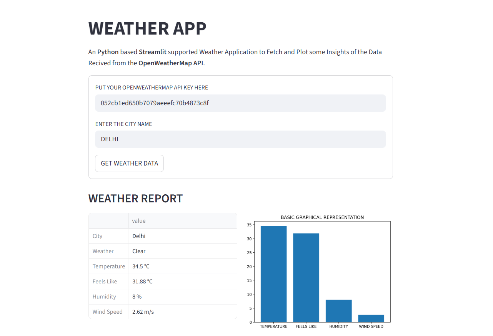

# WEATHER APP - STREAMLIT

- An **Python** based **Streamlit** supported Weather Application to Fetch and Plot some Insights of the Data Recived from the **OpenWeatherMap API**.
- Focuses on **API Integration** **Data Exctraction** and **UI Integration**

## FEATURES
- OpenWeather API Fetching
- Data Insights Excraction
- Report Generation and Plotting

## Live Hosting
- Live App Hosted on Streamlit Cloud Services
- `https://weather-app-tanishkbhatt.streamlit.app`

- Generate a OpenWeatherMap API from `openweathermap.org` and use the Services.
- API_KEY will look like : `052cbXXXXXXXXXXXXXXXXXXXX`

## Tech Stack Used
- Language : `python`
- API Fetching : `requests`
- UI Integration : `streamlit`
- Plotting : `matplotlib`

## Author and Links
- Made by Tanishk Bhatt - A Student and A Programmer
- GITHUB : https://github.com/TanishkBhatt
- PORTFOLIO : https://tanishkbhatt.github.io/TanishkBhatt/

---
